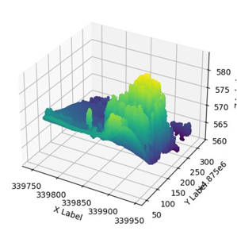
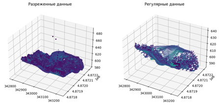

1.	Описание задачи

В рамках хакатона необходимо будет изучить большие данные и разработать алгоритм, способный самостоятельно определять компоненты ландшафта местности. Обоснованно защитить разработанные решения перед потенциальными руководителями/заказчиками.

2.	Описание предлагаемого решения

Проект по распознаванию и подсчету объектов из облака точек, собранных с помощью лидара, включает в себя несколько ключевых этапов обработки данных. Вот подробное описание каждого из этих этапов:

3. Обработка сырых данных

На этом этапе данные, полученные от лидара (рис. 1), очищаются от шума и ошибок, которые могут возникнуть при сборе данных. Это может включать фильтрацию точек, удаление дубликатов и корректировку координат точек.

Рисунок 1 – Визуализация собранных данных

4. Уменьшение плотности точек

Для ускорения последующих процессов и снижения объема данных, можно применить технику downsampling, которая уменьшает количество точек в облаке, сохраняя при этом основную информацию о форме объектов (рис. 2).

Рисунок 2 – Уменьшение плотности точек

5. Нормализация данных

Данные нормализуются для обеспечения единообразия масштаба и единства измерений между различными облаками точек (рис. 3). Это может включать масштабирование координат, приведение всех значений к одному диапазону и т.д.

Рисунок 3 – Нормализация данных

6. Удаление рельефа

Этот шаг направлен на устранение влияния рельефа местности на анализ облака точек. Используются различные алгоритмы, такие как плоская подгонка (plane fitting), чтобы вычеркнуть из облака точки, принадлежащие земле или другим неподвижным поверхностям.

7. Создание модели высоты крон деревьев для обнаружения макушек деревьев

Создается модель высоты крон деревьев, используя алгоритмы машинного обучения и статистические методы, чтобы выявить наиболее вероятные места расположения макушек деревьев. Это позволяет сосредоточиться на анализе облака точек только в интересующем нас регионе. 
8. Вычисление параметров деревьев (диаметр, площадь, высота)

После сегментации облака точек на отдельные деревья, вычисляются их параметры, такие как диаметр, площадь и высота. Эти данные могут быть использованы для дальнейшего анализа или представления результатов в удобной форме.
9. Сегментация на отдельные деревья методом водораздела

Метод водораздела используется для разделения облака точек на отдельные объекты (деревья). Этот подход позволяет идентифицировать границы каждого дерева, даже если они находятся близко друг к другу    (рис. 4).

Рисунок 4 – Сегментация объектов

10. Кластеризация облаков точек на отдельные объекты

Кластеризация облаков точек позволяет группировать похожие объекты вместе, что упрощает процесс подсчета и анализа данных. Алгоритмы кластеризации могут использовать различные метрики сходства и стратегии группирования.

11. Подсчет

Последний этап включает в себя подсчет количества объектов (деревьев) в каждой группе, выделенной на предыдущих этапах. Это может потребовать дополнительных проверок и коррекций, особенно если некоторые объекты были неправильно классифицированы или сгруппированы.

12. Результаты работы

Готовая модель успешно распознает объекты на облаке точек и распределяет их по классам (рис. 6).
Для визуализации данных объекты интересы выделены разными цветами (рис. 5)

Рисунок 5 – Визуализация готового результата 

В результате получилось готовое решение для кластеризации и подсчета объектов на облаке точек. Задача выполнена успешно и протестирована на собранных данных. Конечный результат удовлетворяет поставленным критериям и может применятся на практике.

Рисунок 6 – Кластеризация объектов
